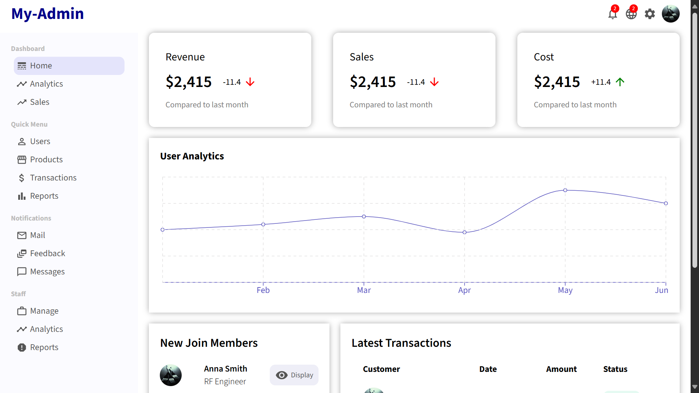

# 🖥️ Admin Dashboard

## Overview

This is an Admin Dashboard application built using React. It provides a comprehensive interface for administrators to manage and monitor various aspects of an application, such as user data, analytics, settings, and more.

## 🔗 Project URL

Check out the live version of the project here: [Admin-Dashboard](https://admin-dashboard-analytics.netlify.app/)

## 🖼️ Screenshots

## 🛠️ Technologies Used

- **React:** A JavaScript library for building user interfaces.

## ✨ Features

- **User Management:** Add, edit, and delete users, with detailed user profiles.

- **Analytics Dashboard:** Visualize key metrics and data with charts and graphs.

## 🚀 Getting Started

To run this project locally, follow these steps:

1. Clone the repository: `git clone https://github.com/Developer-Bilal/my-admin-dashboard.git`
2. Navigate to the project directory: `cd my-admin-dashboard`
3. npm install
4. npm start

The application should now be running on http://localhost:3000.

## 📧 Contact

If you have any questions or suggestions, feel free to reach out:

- Email: bilalchanna67@gmail.com ✉️
- LinkedIn: [Profile](https://www.linkedin.com/in/Engineer-Bilal-Channa) 💼
